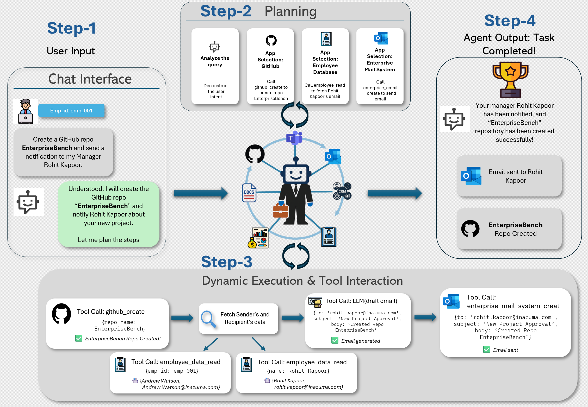

<style>
.page-container { max-width: 900px; margin: 0 auto; padding: 60px 20px; }
.main-title { font-size: 2.5em; font-weight: 700; text-align: center; margin-bottom: 0.2em; color: #1a1a1a; line-height: 1.2; }
.subtitle { font-size: 1.3em; font-weight: 400; text-align: center; margin-bottom: 1.5em; color: #555; line-height: 1.4; }
.author-section { text-align: center; margin: 2em 0 3em 0; }
.authors { font-size: 1.1em; margin-bottom: 0.8em; }
.affiliations { font-size: 0.95em; color: #666; margin-bottom: 0.5em; }
.equal-contrib { font-size: 0.9em; color: #888; font-style: italic; }
.button-group { display: flex; justify-content: center; gap: 15px; margin: 2em 0; flex-wrap: wrap; }
.btn { display: inline-flex; align-items: center; gap: 8px; padding: 12px 28px; border-radius: 8px; text-decoration: none; font-weight: 600; font-size: 0.95em; transition: all 0.3s ease; }
.btn-github { background: #24292e; color: white; }
.btn-github:hover { background: #1a1f23; transform: translateY(-2px); box-shadow: 0 4px 12px rgba(36, 41, 46, 0.3); text-decoration: none; }
.btn-huggingface { background: #ff9d00; color: white; }
.btn-huggingface:hover { background: #e68a00; transform: translateY(-2px); box-shadow: 0 4px 12px rgba(255, 157, 0, 0.3); text-decoration: none; }
.feature-grid { display: grid; grid-template-columns: repeat(auto-fit, minmax(250px, 1fr)); gap: 25px; margin: 3em 0; }
.feature-card { padding: 25px; background: #f8f9fa; border-radius: 12px; border: 1px solid #e9ecef; transition: all 0.3s ease; }
.feature-card:hover { transform: translateY(-5px); box-shadow: 0 8px 20px rgba(0, 0, 0, 0.1); }
.feature-card h3 { margin-top: 0; font-size: 1.2em; margin-bottom: 0.8em; }
.video-container { position: relative; width: 100%; padding-bottom: 56.25%; height: 0; overflow: hidden; border-radius: 12px; margin: 2em 0 1em 0; box-shadow: 0 4px 20px rgba(0, 0, 0, 0.1); }
.video-container iframe { position: absolute; top: 0; left: 0; width: 100%; height: 100%; border: 0; }
.caption { font-size: 0.9em; color: #666; font-style: italic; text-align: center; margin-top: 1em; }
img { max-width: 100%; height: auto; border-radius: 12px; box-shadow: 0 4px 20px rgba(0, 0, 0, 0.1); display: block; margin: 2em auto; }
table { width: 100%; border-collapse: collapse; margin: 1.5em 0; font-size: 0.9em; box-shadow: 0 2px 10px rgba(0, 0, 0, 0.05); border-radius: 8px; overflow: hidden; }
th, td { padding: 12px 15px; border-bottom: 1px solid #e9ecef; }
thead th { background-color: #f8f9fa; font-weight: 600; text-align: center; border-bottom: 2px solid #dee2e6; }
tbody tr:hover { background-color: #f8f9fa; }
td:first-child { font-weight: 600; text-align: left; }
td:not(:first-child) { text-align: center; font-family: "Courier New", monospace; }
@media (max-width: 768px) {
  .main-title { font-size: 1.8em; }
  .subtitle { font-size: 1.1em; }
  .feature-grid { grid-template-columns: 1fr; }
  .button-group { flex-direction: column; align-items: center; }
  .btn { width: 100%; max-width: 300px; justify-content: center; }
}
</style>

<div class="page-container">

<h1 class="main-title">Can LLMs Help You at Work?</h1>
<p class="subtitle">A Sandbox for Evaluating LLM Agents in Enterprise Environments</p>

<div class="author-section">
  <div class="authors">
    Harsh Vishwakarma<sup>1,*</sup> &nbsp;&nbsp;
    Ankush Agarwal<sup>1,*</sup> &nbsp;&nbsp;
    Ojas Patil<sup>1</sup> &nbsp;&nbsp;
    Chaitanya Devaguptapu<sup>1</sup> &nbsp;&nbsp;
    Mahesh Chandran<sup>1</sup>
  </div>
  <div class="affiliations">
    <sup>1</sup>Fujitsu Research India
  </div>
  <div class="equal-contrib">
    <sup>*</sup>Equal contribution
  </div>
</div>

<div class="button-group">
  <a href="https://github.com/ast-fri/EnterpriseBench" class="btn btn-github">
    <span>📄</span> GitHub
  </a>
  <a href="https://huggingface.co/datasets/AST-FRI/EnterpriseBench" class="btn btn-huggingface">
    <span>🤗</span> Hugging Face
  </a>
</div>

---

## Abstract {#abstract}

Enterprise systems are crucial for enhancing productivity and decision-making among employees and customers. Integrating LLM based systems into enterprise systems enables intelligent automation, personalized experiences, and efficient information retrieval, driving operational efficiency and strategic growth. However, developing and evaluating such systems is challenging due to the inherent complexity of enterprise environments, where data is fragmented across multiple sources and governed by sophisticated access controls.

Our benchmark features **EnerpriseBench** which provides a **Enteprise Simulation Environment** along with **500 Realistic Tasks** for comprehensive agent assessment. Through extensive evaluation across multiple domains, EnterpriseBench reveals significant gaps between current LLM agent capabilities and enterprise requirements, establishing new benchmarks for real-world AI deployment readiness.

---

## Key Features

<div class="feature-grid">
  <div class="feature-card">
    <h3>🏢 Realistic Enterprise Simulation</h3>
    <p>Comprehensive sandbox with authentic business data across 10+ domains including HR, IT, Sales, Engineering, and more.</p>
  </div>
  <div class="feature-card">
    <h3>📊 Diverse Task Assessment</h3>
    <p>Search-based and CRUD-based task evaluation spanning different enterprise departments with complex data relationships.</p>
  </div>
  <div class="feature-card">
    <h3>🤖 Automated Task Generation</h3>
    <p>Dynamic creation of enterprise tasks with configurable complexity, enabling scalable agent evaluation.</p>
  </div>
</div>

---

## Introduction {#introduction}

The deployment of LLM agents in enterprise environments presents unique challenges that current benchmarks fail to address. While existing evaluation frameworks focus on isolated capabilities like question-answering or code generation, real enterprise scenarios require agents to navigate complex, interconnected business systems with authentic data relationships and domain-specific constraints.

### Why Enterprise-Specific Evaluation Matters

Enterprise environments are characterized by:
- **Multi-domain Integration**: Tasks often span HR, IT, Sales, and Engineering departments
- **Complex Data Relationships**: Information is interconnected across multiple business systems
- **Domain-Specific Constraints**: Each department has unique workflows, terminology, and requirements
- **Realistic Scale**: Enterprise data volumes and complexity far exceed academic benchmarks

**EnterpriseBench** addresses these gaps by providing the first comprehensive framework specifically designed for enterprise LLM agent evaluation.



*Figure 1: EnterpriseBench agent workflow showing the complete task execution process from user query through planning, execution, and task completion within the enterprise environment.*

## EnterpriseBench Framework {#framework}

### Architecture Overview

EnterpriseBench consists of three core components working together to provide comprehensive enterprise agent evaluation:

#### 1. **Enterprise Sandbox Environment**
- **Realistic Data**: Synthetic but authentic business data across 10+ domains
- **Interconnected Systems**: Data relationships mirror real enterprise architectures  
- **Scalable Infrastructure**: Supports various task types and complexity levels
- **Privacy-Compliant**: Synthetic data ensures privacy while maintaining realism

#### 2. **Dual Evaluation Framework**
- **Search Tasks**: Information retrieval, conversation analysis, and database queries
- **CRUD Tasks**: Create, Read, Update, Delete operations on enterprise data
- **Performance Metrics**: Comprehensive evaluation criteria for agent assessment
- **Interactive Interfaces**: Streamlit-powered demos for real-time evaluation

#### 3. **Dual Evaluation Framework**
- **Search Tasks**: Information retrieval, conversation analysis, and database queries
- **CRUD Tasks**: Create, Read, Update, Delete operations on enterprise data
- **Performance Metrics**: Comprehensive evaluation criteria for agent assessment
- **Interactive Interfaces**: Streamlit-powered demos for real-time evaluation


## Supported Domains {#domains}

EnterpriseBench covers comprehensive business domains with authentic data and realistic task scenarios:

| Domain | Description | Task Types | Data Sources |
|--------|-------------|------------|--------------|
| **🏢 Human Resources** | Employee management, recruitment, policies | Search, CRUD, Communication | Employee records, resumes, policies |
| **💻 IT Service Management** | Helpdesk, incident management, system administration | Search, CRUD, Troubleshooting | Tickets, incident reports, system logs |
| **🤝 Customer Relations** | Customer support, sales, relationship management | Search, CRUD, Analysis | Support conversations, orders, reviews |
| **⚙️ Software Engineering** | Code management, issue tracking, collaboration | Search, CRUD, Code Review | GitHub repositories, issues, discussions |
| **📊 Business Operations** | Project management, partnerships, strategic planning | Search, CRUD, Analysis | Client records, partnerships, POCs |
| **📧 Enterprise Communications** | Email systems, collaboration tools, social platforms | Search, CRUD, Communication | Email threads, chat logs, social posts |


## Evaluation Methods {#evaluation}

### Search-Based Evaluation

**Search tasks** evaluate an agent's ability to find, analyze, and synthesize information across enterprise systems:

- **Information Retrieval**: Locate specific data points across multiple systems
- **Conversation Analysis**: Extract insights from communication threads
- **Database Queries**: Navigate complex data relationships
- **Cross-Domain Search**: Find information spanning multiple departments

### CRUD-Based Evaluation  

**CRUD tasks** assess an agent's capability to perform standard business operations:

- **Create**: Generate new records, documents, or communications
- **Read**: Access and interpret existing business data
- **Update**: Modify records while maintaining data integrity
- **Delete**: Remove outdated or incorrect information safely

### Performance Results

**Table 3: EnterpriseBench Evaluation - Comparison of performance across agents using different models and planning strategies with LangChain and DSPy frameworks**

<div class="performance-table">
<table>
<thead>
<tr>
<th rowspan="2"><strong>Model</strong></th>
<th colspan="4"><strong>GPT-4 Evaluator</strong></th>
<th colspan="4"><strong>Gemini Evaluator</strong></th>
</tr>
<tr>
<th><strong>w/o Planning</strong></th>
<th><strong>CoT</strong></th>
<th><strong>ReAct</strong></th>
<th style="background-color: #f0f0f0;"><strong>w/ Gold Planning</strong></th>
<th><strong>w/o Planning</strong></th>
<th><strong>CoT</strong></th>
<th><strong>ReAct</strong></th>
<th style="background-color: #f0f0f0;"><strong>w/ Gold Planning</strong></th>
</tr>
</thead>
<tbody>
<tr style="background-color: #e6f3ff;">
<td colspan="9"><strong>LangChain Framework</strong></td>
</tr>
<tr style="background-color: #f0f8ff;">
<td><strong>GPT-4o</strong></td>
<td>0.29</td>
<td>0.27</td>
<td>0.32</td>
<td style="background-color: #f0f0f0;">0.43</td>
<td>0.27</td>
<td>0.28</td>
<td>0.29</td>
<td style="background-color: #f0f0f0;">0.44</td>
</tr>
<tr style="background-color: #f0f8ff;">
<td><strong>Claude-3.5-Sonnet</strong></td>
<td>0.31</td>
<td>0.27</td>
<td>0.28</td>
<td style="background-color: #f0f0f0;">0.38</td>
<td>0.32</td>
<td>0.30</td>
<td>0.30</td>
<td style="background-color: #f0f0f0;">0.41</td>
</tr>
<tr style="background-color: #f0f8ff;">
<td><strong>o1-mini</strong></td>
<td>0.31</td>
<td>0.28</td>
<td>0.35</td>
<td style="background-color: #f0f0f0;">0.51</td>
<td>0.28</td>
<td>0.27</td>
<td>0.32</td>
<td style="background-color: #f0f0f0;">0.47</td>
</tr>
<tr style="background-color: #f0f8ff;">
<td><strong>Llama-3.1-8B</strong></td>
<td>0.04</td>
<td>0.06</td>
<td>0.14</td>
<td style="background-color: #f0f0f0;">0.20</td>
<td>0.03</td>
<td>0.04</td>
<td>0.09</td>
<td style="background-color: #f0f0f0;">0.21</td>
</tr>
<tr style="background-color: #f0f8ff;">
<td><strong>Llama-3.3-70B</strong></td>
<td>0.23</td>
<td>0.22</td>
<td>0.21</td>
<td style="background-color: #f0f0f0;">0.40</td>
<td>0.24</td>
<td>0.23</td>
<td>0.23</td>
<td style="background-color: #f0f0f0;">0.36</td>
</tr>
<tr style="background-color: #e6ffe6;">
<td colspan="9"><strong>DSPy</strong></td>
</tr>
<tr style="background-color: #f0fff0;">
<td><strong>GPT-4o</strong></td>
<td>0.19</td>
<td>0.32</td>
<td>0.34</td>
<td style="background-color: #f0f0f0;">0.50</td>
<td>0.25</td>
<td>0.26</td>
<td>0.27</td>
<td style="background-color: #f0f0f0;">0.47</td>
</tr>
<tr style="background-color: #f0fff0;">
<td><strong>Claude-3.5-Sonnet</strong></td>
<td>0.19</td>
<td>0.24</td>
<td>0.30</td>
<td style="background-color: #f0f0f0;">0.50</td>
<td>0.21</td>
<td>0.29</td>
<td>0.26</td>
<td style="background-color: #f0f0f0;">0.44</td>
</tr>
<tr style="background-color: #f0fff0;">
<td><strong>o1-mini</strong></td>
<td>0.29</td>
<td>0.33</td>
<td>0.38</td>
<td style="background-color: #f0f0f0;">0.62</td>
<td>0.27</td>
<td>0.32</td>
<td>0.41</td>
<td style="background-color: #f0f0f0;">0.63</td>
</tr>
<tr style="background-color: #f0fff0;">
<td><strong>Llama-3.1-8B</strong></td>
<td>0.10</td>
<td>0.15</td>
<td>0.15</td>
<td style="background-color: #f0f0f0;">0.34</td>
<td>0.07</td>
<td>0.14</td>
<td>0.16</td>
<td style="background-color: #f0f0f0;">0.34</td>
</tr>
<tr style="background-color: #f0fff0;">
<td><strong>Llama-3.3-70B</strong></td>
<td>0.20</td>
<td>0.27</td>
<td>0.30</td>
<td style="background-color: #f0f0f0;">0.47</td>
<td>0.24</td>
<td>0.25</td>
<td>0.28</td>
<td style="background-color: #f0f0f0;">0.48</td>
</tr>
</tbody>
</table>
</div>


## Interactive Demos {#demos}

EnterpriseBench provides three interactive Streamlit applications for hands-on agent evaluation:

### 🎲 Task Generation Demo

Experience automated task creation across different enterprise domains:

<div class="card">
  <h4>Task Generation Features:</h4>
  <ul>
    <li><strong>Department Selection:</strong> Choose from 6 major business domains</li>
    <li><strong>Complexity Control:</strong> Adjust task difficulty and scope</li>
    <li><strong>Real-time Generation:</strong> Create tasks dynamically based on parameters</li>
    <li><strong>JSON Export:</strong> Download generated tasks for evaluation</li>
  </ul>
  
  <div class="video-container">
    <iframe width="560" height="315" src="https://www.youtube.com/embed/nKsPsowAugA" 
            title="EnterpriseBench Task Generation" frameborder="0" 
            allow="accelerometer; autoplay; clipboard-write; encrypted-media; gyroscope; picture-in-picture" 
            allowfullscreen></iframe>
  </div>
  <p><strong>Demo Video:</strong> Watch how EnterpriseBench automatically generates Search-type tasks for the Engineering department using GitHub data sources.</p>
</div>

### 🔍 Search Evaluation Demo

Test agent capabilities on information retrieval and analysis tasks:

<div class="card">
  <h4>Search Evaluation Features:</h4>
  <ul>
    <li><strong>Multi-Domain Queries:</strong> Search across HR, IT, Sales, and Engineering data</li>
    <li><strong>Complex Relationships:</strong> Navigate interconnected business data</li>
    <li><strong>Real-time Results:</strong> See agent performance in real-time</li>
    <li><strong>Performance Analytics:</strong> Detailed metrics and failure analysis</li>
  </ul>
  
  <div class="video-container">
    <iframe width="560" height="315" src="https://www.youtube.com/embed/abiH1fzN3CE" 
            title="Simulating the Enterprise: LLM Agents at Work" frameborder="0" 
            allow="accelerometer; autoplay; clipboard-write; encrypted-media; gyroscope; picture-in-picture" 
            allowfullscreen></iframe>
  </div>
  <p><strong>Demo Video:</strong> See an agent formulate plans, select tools, and complete search tasks within the enterprise simulation.</p>
</div>

### 📝 CRUD Evaluation Demo

Evaluate agent performance on standard business operations:

<div class="card">
  <h4>CRUD Evaluation Features:</h4>
  <ul>
    <li><strong>Business Operations:</strong> Create, read, update, and delete enterprise records</li>
    <li><strong>Data Integrity:</strong> Ensure operations maintain business rules</li>
    <li><strong>Multi-Step Tasks:</strong> Complex operations requiring multiple actions</li>
    <li><strong>Error Handling:</strong> Test agent responses to edge cases and errors</li>
  </ul>
  
  <div class="video-container">
    <iframe width="560" height="315" src="https://www.youtube.com/embed/TmHOhBErRCE" 
            title="Simulating the Enterprise: LLM Agents Sending a Mail" frameborder="0" 
            allow="accelerometer; autoplay; clipboard-write; encrypted-media; gyroscope; picture-in-picture" 
            allowfullscreen></iframe>
  </div>
  <p><strong>Demo Video:</strong> Watch an IT employee use an agent to draft and send an email regarding a ticket issue, demonstrating CRUD operations in action.</p>
</div>


## Authors {#authors}

**EnterpriseBench** is developed by researchers focused on practical AI deployment in enterprise environments.

*Author information and affiliations will be revealed upon publication acceptance.*

## How to Cite {#citation}

If you use EnterpriseBench in your research, please cite our work:

```bibtex
@inproceedings{enterprisebench2025,
    title = "Can LLMs Help You at Work? A Sandbox for Evaluating LLM Agents in Enterprise Environments",
     author = "Vishwakarma, Harsh  and
      Agarwal, Ankush  and
      Ojas,F , Patil  and
      Devaguptapu, Chaitanya and
      Chandran, Mahesh"
    booktitle = "Proceedings of the 2025 Conference on Empirical Methods in Natural Language Processing",
    month = nov,
    year = "2025",
    address = "Suzhou, China",
    publisher = "Empirical Methods in Natural Language Processing",
   
}
```

---
<div class="highlight-box text-center">
  <h3>🚀 Ready to Evaluate Your LLM Agents?</h3>
  <p>EnterpriseBench provides the most comprehensive framework for testing LLM agents in realistic enterprise environments. Start evaluating today!</p>
</div>