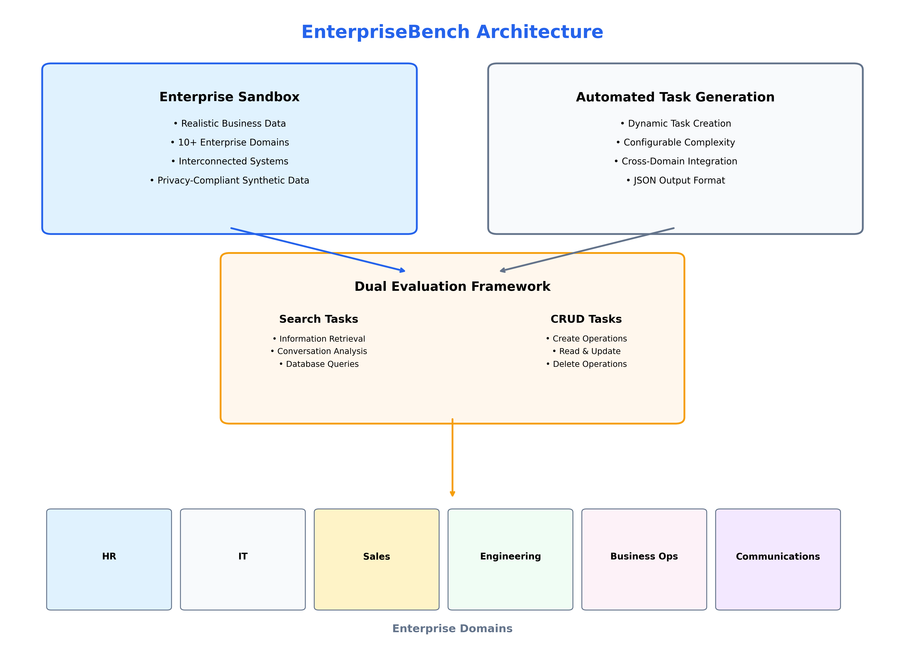

<div class="nav-menu">
  <ul>
    <li><a href="#abstract">Abstract</a></li>
    <li><a href="#introduction">Introduction</a></li>
    <li><a href="#framework">EnterpriseBench Framework</a></li>
    <li><a href="#domains">Supported Domains</a></li>
    <li><a href="#evaluation">Evaluation Methods</a></li>
    <li><a href="#demos">Interactive Demos</a></li>
    <li><a href="#implementation">Implementation</a></li>
    <li><a href="#authors">Authors</a></li>
    <li><a href="#citation">Citation</a></li>
  </ul>
</div>

## Abstract {#abstract}

**EnterpriseBench** introduces a comprehensive framework for evaluating Large Language Model (LLM) agents within realistic enterprise environments. Unlike existing benchmarks that focus on isolated tasks, EnterpriseBench provides a complete ecosystem with authentic business data spanning **10+ enterprise domains** including HR, IT Service Management, Customer Relations, Software Engineering, and Business Operations. 

Our framework features **automated task generation**, **dual evaluation modes** (Search and CRUD operations), and **interactive web interfaces** for comprehensive agent assessment. Through extensive evaluation across multiple domains, EnterpriseBench reveals significant gaps between current LLM agent capabilities and enterprise requirements, establishing new benchmarks for real-world AI deployment readiness.

<div class="highlight-box">
  <p><strong>🎯 Key Contributions:</strong></p>
  <ul>
    <li><strong>Realistic Enterprise Simulation:</strong> Comprehensive sandbox with authentic business data across 10+ domains</li>
    <li><strong>Automated Task Generation:</strong> Dynamic creation of enterprise tasks with configurable complexity</li>
    <li><strong>Dual Evaluation Framework:</strong> Search-based and CRUD-based task assessment</li>
    <li><strong>Interactive Demos:</strong> Streamlit-powered interfaces for easy agent testing and visualization</li>
  </ul>
</div>

## Introduction {#introduction}

The deployment of LLM agents in enterprise environments presents unique challenges that current benchmarks fail to address. While existing evaluation frameworks focus on isolated capabilities like question-answering or code generation, real enterprise scenarios require agents to navigate complex, interconnected business systems with authentic data relationships and domain-specific constraints.

### Why Enterprise-Specific Evaluation Matters

Enterprise environments are characterized by:
- **Multi-domain Integration**: Tasks often span HR, IT, Sales, and Engineering departments
- **Complex Data Relationships**: Information is interconnected across multiple business systems
- **Domain-Specific Constraints**: Each department has unique workflows, terminology, and requirements
- **Realistic Scale**: Enterprise data volumes and complexity far exceed academic benchmarks

**EnterpriseBench** addresses these gaps by providing the first comprehensive framework specifically designed for enterprise LLM agent evaluation.


*Figure 1: EnterpriseBench framework overview showing the integration of enterprise sandbox, automated task generation, and dual evaluation modes for comprehensive LLM agent assessment.*

## EnterpriseBench Framework {#framework}

### Architecture Overview

EnterpriseBench consists of three core components working together to provide comprehensive enterprise agent evaluation:

#### 1. **Enterprise Sandbox Environment**
- **Realistic Data**: Synthetic but authentic business data across 10+ domains
- **Interconnected Systems**: Data relationships mirror real enterprise architectures  
- **Scalable Infrastructure**: Supports various task types and complexity levels
- **Privacy-Compliant**: Synthetic data ensures privacy while maintaining realism

#### 2. **Automated Task Generation System**
- **Dynamic Creation**: Automatically generates tasks based on department and complexity requirements
- **Configurable Parameters**: Customizable task types, difficulty levels, and domain focus
- **JSON Output Format**: Structured task definitions for easy integration
- **Cross-Domain Tasks**: Generates tasks spanning multiple business domains

#### 3. **Dual Evaluation Framework**
- **Search Tasks**: Information retrieval, conversation analysis, and database queries
- **CRUD Tasks**: Create, Read, Update, Delete operations on enterprise data
- **Performance Metrics**: Comprehensive evaluation criteria for agent assessment
- **Interactive Interfaces**: Streamlit-powered demos for real-time evaluation


## Supported Domains {#domains}

EnterpriseBench covers comprehensive business domains with authentic data and realistic task scenarios:

| Domain | Description | Task Types | Data Sources |
|--------|-------------|------------|--------------|
| **🏢 Human Resources** | Employee management, recruitment, policies | Search, CRUD, Communication | Employee records, resumes, policies |
| **💻 IT Service Management** | Helpdesk, incident management, system administration | Search, CRUD, Troubleshooting | Tickets, incident reports, system logs |
| **🤝 Customer Relations** | Customer support, sales, relationship management | Search, CRUD, Analysis | Support conversations, orders, reviews |
| **⚙️ Software Engineering** | Code management, issue tracking, collaboration | Search, CRUD, Code Review | GitHub repositories, issues, discussions |
| **📊 Business Operations** | Project management, partnerships, strategic planning | Search, CRUD, Analysis | Client records, partnerships, POCs |
| **📧 Enterprise Communications** | Email systems, collaboration tools, social platforms | Search, CRUD, Communication | Email threads, chat logs, social posts |


## Evaluation Methods {#evaluation}

### Search-Based Evaluation

**Search tasks** evaluate an agent's ability to find, analyze, and synthesize information across enterprise systems:

- **Information Retrieval**: Locate specific data points across multiple systems
- **Conversation Analysis**: Extract insights from communication threads
- **Database Queries**: Navigate complex data relationships
- **Cross-Domain Search**: Find information spanning multiple departments

### CRUD-Based Evaluation  

**CRUD tasks** assess an agent's capability to perform standard business operations:

- **Create**: Generate new records, documents, or communications
- **Read**: Access and interpret existing business data
- **Update**: Modify records while maintaining data integrity
- **Delete**: Remove outdated or incorrect information safely

### Performance Results

**Table 3: EnterpriseBench Performance Results**

| Model | Search Tasks | CRUD Tasks | Overall | Cross-Domain | Efficiency |
|-------|-------------|------------|---------|--------------|------------|
| **GPT-4** | 78.5% | 72.3% | 75.4% | 68.9% | 3.2 steps |
| **GPT-3.5-Turbo** | 65.2% | 58.7% | 61.9% | 52.4% | 4.1 steps |
| **Claude-3** | 74.1% | 69.8% | 71.9% | 64.2% | 3.5 steps |
| **Gemini-Pro** | 69.3% | 63.5% | 66.4% | 58.7% | 3.8 steps |
| **LLaMA-2-70B** | 58.9% | 51.2% | 55.0% | 45.3% | 4.7 steps |

*Performance metrics show task completion rates across different evaluation modes. Cross-Domain measures success on tasks spanning multiple enterprise departments. Efficiency indicates average steps required for task completion.*

## Interactive Demos {#demos}

EnterpriseBench provides three interactive Streamlit applications for hands-on agent evaluation:

### 🎲 Task Generation Demo

Experience automated task creation across different enterprise domains:

<div class="card">
  <h4>Task Generation Features:</h4>
  <ul>
    <li><strong>Department Selection:</strong> Choose from 6 major business domains</li>
    <li><strong>Complexity Control:</strong> Adjust task difficulty and scope</li>
    <li><strong>Real-time Generation:</strong> Create tasks dynamically based on parameters</li>
    <li><strong>JSON Export:</strong> Download generated tasks for evaluation</li>
  </ul>
  
  <div class="video-container">
    <iframe width="560" height="315" src="https://www.youtube.com/embed/nKsPsowAugA" 
            title="EnterpriseBench Task Generation" frameborder="0" 
            allow="accelerometer; autoplay; clipboard-write; encrypted-media; gyroscope; picture-in-picture" 
            allowfullscreen></iframe>
  </div>
  <p><strong>Demo Video:</strong> Watch how EnterpriseBench automatically generates Search-type tasks for the Engineering department using GitHub data sources.</p>
</div>

### 🔍 Search Evaluation Demo

Test agent capabilities on information retrieval and analysis tasks:

<div class="card">
  <h4>Search Evaluation Features:</h4>
  <ul>
    <li><strong>Multi-Domain Queries:</strong> Search across HR, IT, Sales, and Engineering data</li>
    <li><strong>Complex Relationships:</strong> Navigate interconnected business data</li>
    <li><strong>Real-time Results:</strong> See agent performance in real-time</li>
    <li><strong>Performance Analytics:</strong> Detailed metrics and failure analysis</li>
  </ul>
  
  <div class="video-container">
    <iframe width="560" height="315" src="https://www.youtube.com/embed/abiH1fzN3CE" 
            title="Simulating the Enterprise: LLM Agents at Work" frameborder="0" 
            allow="accelerometer; autoplay; clipboard-write; encrypted-media; gyroscope; picture-in-picture" 
            allowfullscreen></iframe>
  </div>
  <p><strong>Demo Video:</strong> See an agent formulate plans, select tools, and complete search tasks within the enterprise simulation.</p>
</div>

### 📝 CRUD Evaluation Demo

Evaluate agent performance on standard business operations:

<div class="card">
  <h4>CRUD Evaluation Features:</h4>
  <ul>
    <li><strong>Business Operations:</strong> Create, read, update, and delete enterprise records</li>
    <li><strong>Data Integrity:</strong> Ensure operations maintain business rules</li>
    <li><strong>Multi-Step Tasks:</strong> Complex operations requiring multiple actions</li>
    <li><strong>Error Handling:</strong> Test agent responses to edge cases and errors</li>
  </ul>
  
  <div class="video-container">
    <iframe width="560" height="315" src="https://www.youtube.com/embed/TmHOhBErRCE" 
            title="Simulating the Enterprise: LLM Agents Sending a Mail" frameborder="0" 
            allow="accelerometer; autoplay; clipboard-write; encrypted-media; gyroscope; picture-in-picture" 
            allowfullscreen></iframe>
  </div>
  <p><strong>Demo Video:</strong> Watch an IT employee use an agent to draft and send an email regarding a ticket issue, demonstrating CRUD operations in action.</p>
</div>

## Implementation Details {#implementation}

### Getting Started

EnterpriseBench is designed for easy setup and immediate use:

```bash
# Clone the repository
git clone https://github.com/ast-fri/EnterpriseBench.git
cd EnterpriseBench

# Set up environment
python -m venv venv
source venv/bin/activate  # On Windows: venv\Scripts\activate

# Install dependencies
cd Code
pip install -r requirements.txt

# Configure API keys
# Create .env files with your AWS and Azure credentials

# Run demos
cd TaskGeneration && streamlit run task_gen_app.py
cd ../Simulation/SearchEvaluation && streamlit run search_demo.py
cd ../CrudEvaluation && streamlit run crud_demo.py
```

### Technical Requirements

- **Python 3.10+**: Modern Python environment
- **API Access**: AWS and Azure AI credentials for LLM integration
- **Streamlit**: Interactive web interface framework
- **Scalable Storage**: Organized data structure supporting various task types

### Integration Options

EnterpriseBench supports multiple integration approaches:

- **Standalone Evaluation**: Use provided demos for immediate testing
- **API Integration**: Integrate with existing agent frameworks
- **Custom Extensions**: Add new domains or task types
- **Batch Processing**: Evaluate multiple agents systematically

### Data Infrastructure

Our enterprise sandbox includes:

- **10+ Business Domains**: Comprehensive coverage of enterprise functions
- **Realistic Relationships**: Authentic data interconnections
- **Scalable Architecture**: Supports various evaluation scenarios
- **Privacy Compliance**: Synthetic data with realistic characteristics

## Authors {#authors}

**EnterpriseBench** is developed by researchers focused on practical AI deployment in enterprise environments.

*Author information and affiliations will be revealed upon publication acceptance.*

## How to Cite {#citation}

If you use EnterpriseBench in your research, please cite our work:

```bibtex
@inproceedings{enterprisebench2025,
    title = "EnterpriseBench: Evaluating {LLM} Agents in Simulated Enterprise Environments",
    author = "Anonymous Authors",
    booktitle = "Proceedings of the 2025 Conference on Empirical Methods in Natural Language Processing",
    month = nov,
    year = "2025",
    address = "Miami, Florida, USA",
    publisher = "Association for Computational Linguistics",
    note = "Under Review"
}
```

---

<div class="text-center mt-large">
  <a href="https://anonymous.4open.science/r/EnterpriseBench-87B1/" class="btn">📊 Access Dataset</a>
  <a href="https://anonymous.4open.science/r/EnterpriseBench-87B1/" class="btn btn-secondary">💻 View Code</a>
</div>

<div class="highlight-box text-center">
  <h3>🚀 Ready to Evaluate Your LLM Agents?</h3>
  <p>EnterpriseBench provides the most comprehensive framework for testing LLM agents in realistic enterprise environments. Start evaluating today!</p>
</div>